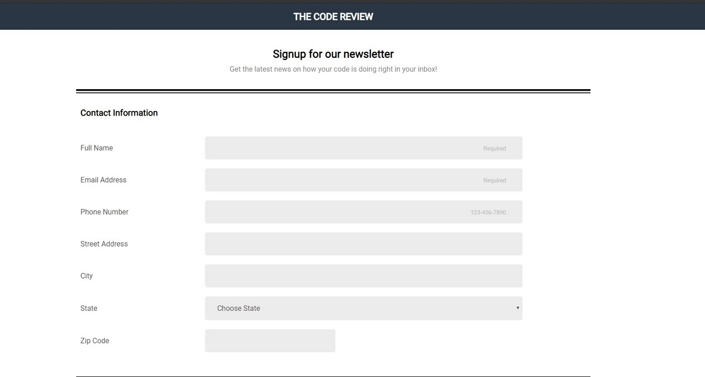

# Teachdegree-project 3
> A mobile-friendly registration form using a wide variety of HTML form input types and attributes built using HTML and CSS.

## Table of contents
* [General info](#general-info)
* [Screenshots](#screenshots)
* [Technologies](#technologies)
* [Features](#features)
* [Contact](#contact)

## General info
The third project that I have built as a signup form for a newsletter. It uses flexbox for its layout and features focus states, input patterns, and custom CSS checkboxes/radio buttons.

## Screenshots

## Technologies
* CSS3
* HTML5

## Features
List of features ready and TODOs for future development
* Custom CSS checkboxes/radio buttons
* Flexbox layout
* Mobile-first design

To-do list:
* Convert CSS to SASS
* Connect form to a backend server

## Contact
Created by [@JordanBurch101](https://github.com/Jordanburch101) - feel free to contact me!